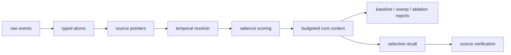

# Core Context Compiler

RAG is recall, not memory. Memory should be compiled into core context.

Core Context Compiler turns raw agent history into compact, typed, provenance-linked, temporally valid core context while keeping recall and evidence outside the always-loaded prompt.

## MVP

This repository implements the evaluation-first MVP:

- typed memory atoms
- source pointers and evidence recovery
- temporal supersession
- salience-gated budget selection
- verbose, compact, DSL, and macro rendering
- deterministic synthetic benchmark and baseline comparison

The MVP is designed to run without external LLM credentials. OpenAI Structured Outputs support is exposed as an interface, while tests use deterministic mocks.

## Quickstart

```bash
uv sync --extra dev
uv run pytest
uv run python scripts/run_eval.py --dataset datasets/synthetic --out reports/latest
uv run python scripts/run_ablation.py --dataset datasets/synthetic --out reports/ablation
```

Artifacts:

- `metrics.json`
- `per_question.jsonl`
- `selected_memory.jsonl`
- `omitted_memory.jsonl`
- `summary.md`

## Core idea

Raw events are normalized, extracted into typed atoms, linked to source spans, resolved for temporal validity, scored for salience, selected under a token budget, and rendered into compact prompt-ready core context. Recall remains external and is used only when core context is insufficient or source verification is required.



## Evaluation phase

The current focus is proving when compiled core context wins or fails:

- baseline comparison
- budget sweep at 128, 256, 512, 1024, and 2048 tokens
- pointer / temporal / salience / recall ablations
- hardened synthetic cases with distractors, stale facts, ambiguity, unknowns, and poisoning
- LongMemEval-S subset adapter scaffold

## v0.2 Evaluation

Run the gauntlet:

```bash
uv run python scripts/run_eval_gauntlet.py --dataset synthetic_v2 --out reports/v0.2_eval_gauntlet
```

Verify:

```bash
uv run pytest
uv run ruff check .
```

Read `reports/v0.2_eval_gauntlet/summary.md` first. It states whether `compressed_core_plus_recall` beats `naive_rag`, where it loses, the best budget, the best representation, the top failure modes, and the next implementation task.

Current limitations:

- `synthetic_v2` is deterministic and mock-driven.
- LongMemEval scoring is not part of v0.2.
- Latency is local runner latency, not external LLM latency.
- Reports are generated locally and are not CI artifacts yet.

## v1.0 Work

Run the current release gate:

```bash
uv run python scripts/run_v1_release_gate.py --out reports/v1_release_gate
```

Focused runners:

```bash
uv run python scripts/run_token_efficiency.py --dataset synthetic_v2 --out reports/v0.3_token_efficiency
uv run python scripts/run_public_benchmarks.py --out reports/v0.4_public_benchmarks
uv run python scripts/run_public_benchmarks.py --out reports/v0.5_real_external
uv run python scripts/ingest_locomo.py --subset-size 30 --out datasets/public_locomo_mini
uv run python scripts/run_public_benchmarks.py --include-real-locomo --out reports/v0.4_public_benchmarks_real
uv run python scripts/run_full_ablation.py --dataset synthetic_v2 --out reports/v0.5_full_modules
uv run python scripts/run_security_eval.py --dataset synthetic_v2 --out reports/v0.6_security
uv run python scripts/run_backend_adapter_eval.py --out reports/v0.8_backend_adapters
```

Committed summaries live in `docs/benchmarks/`. Raw reports remain gitignored.

Current known limitations:

- Token inversion currently fails: compiled core uses more tokens than naive RAG on `synthetic_v2`.
- LoCoMo real mini is the only committed real external mini subset.
- LongMemEval-S and MemoryAgentBench are still adapter-only unless upstream data is ingested.
- Source metrics are labeled exact, approximated, or unavailable; approximated source metrics are not exact validation.
