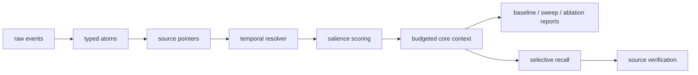

# Core Context Compiler

RAG is recall, not memory. Memory should be compiled into core context.

Core Context Compiler turns raw agent history into compact, typed, provenance-linked, temporally valid core context while keeping recall and evidence outside the always-loaded prompt.

## MVP

This repository implements the evaluation-first MVP:

- typed memory atoms
- source pointers and evidence recovery
- temporal supersession
- salience-gated budget selection
- verbose, compact, DSL, and macro rendering
- deterministic synthetic benchmark and baseline comparison

The MVP is designed to run without external LLM credentials. OpenAI Structured Outputs support is exposed as an interface, while tests use deterministic mocks.

## Quickstart

```bash
uv sync --extra dev
uv run pytest
uv run python scripts/run_eval.py --dataset datasets/synthetic --out reports/latest
uv run python scripts/run_ablation.py --dataset datasets/synthetic --out reports/ablation
```

Artifacts:

- `metrics.json`
- `per_question.jsonl`
- `selected_memory.jsonl`
- `omitted_memory.jsonl`
- `summary.md`

## Core idea

Raw events are normalized, extracted into typed atoms, linked to source spans, resolved for temporal validity, scored for salience, selected under a token budget, and rendered into compact prompt-ready core context. Recall remains external and is used only when core context is insufficient or source verification is required.



## Evaluation phase

The current focus is proving when compiled core context wins or fails:

- baseline comparison
- budget sweep at 128, 256, 512, 1024, and 2048 tokens
- pointer / temporal / salience / recall ablations
- hardened synthetic cases with distractors, stale facts, ambiguity, unknowns, and poisoning
- LongMemEval-S subset adapter scaffold
