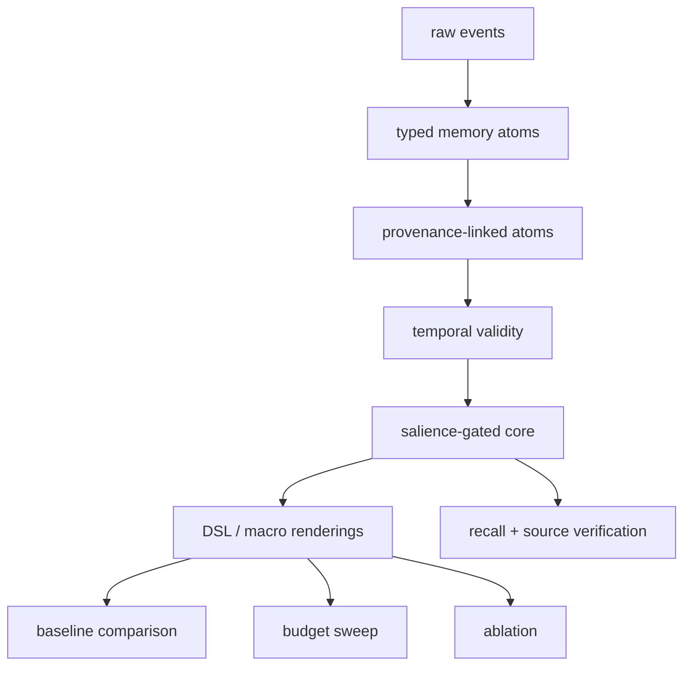

# Architecture

Core Context Compiler is a memory compilation layer, not a generic RAG app.

Pipeline:

1. raw events
2. event normalization
3. typed memory atom extraction
4. source pointer attachment
5. temporal validity resolution
6. salience scoring
7. budgeted core selection
8. DSL rendering
9. core context injection
10. recall and source verification when needed

The MVP keeps LLM calls optional. Deterministic mocks make the benchmark reproducible in CI.

