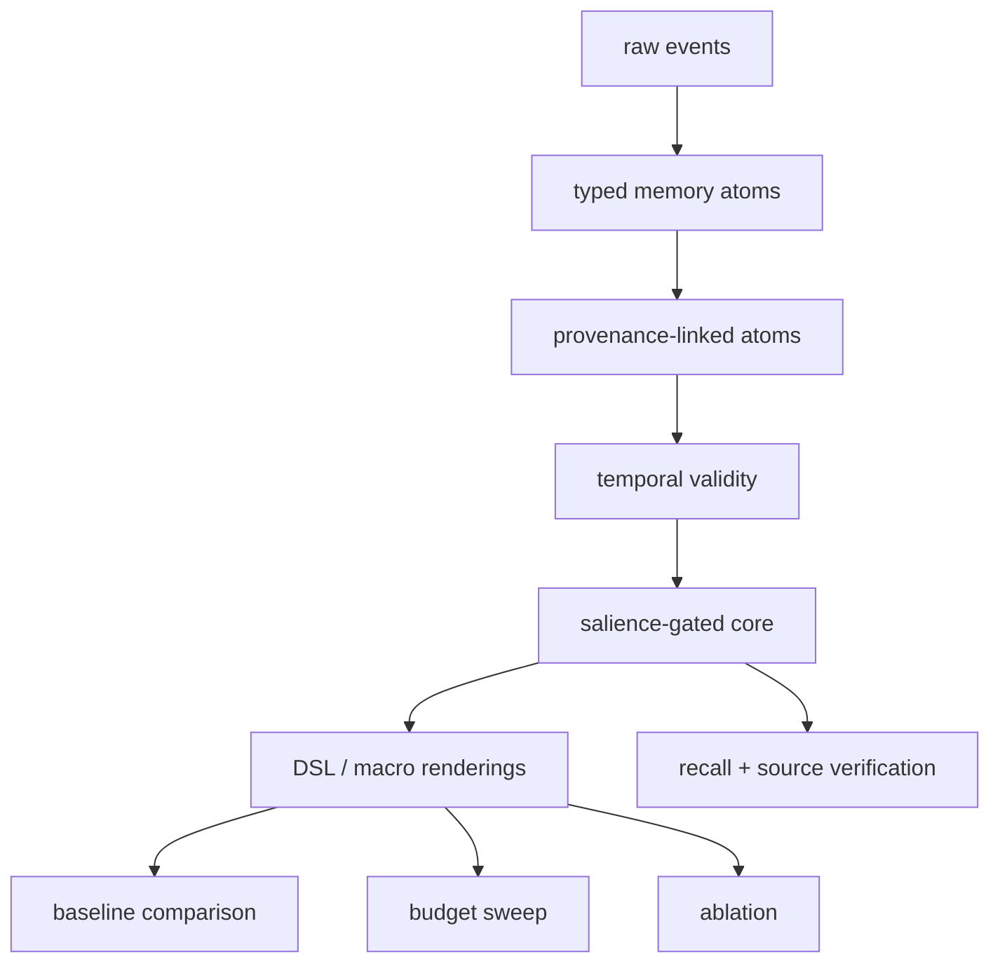

# Architecture

Core Context Compiler is a memory compilation layer, not a generic RAG app.

Pipeline:

1. raw events
2. event normalization
3. typed memory atom extraction
4. source pointer attachment
5. temporal validity resolution
6. salience scoring
7. budgeted core selection
8. DSL rendering
9. core context injection
10. recall and source verification when needed

The MVP keeps LLM calls optional. Deterministic mocks make the benchmark reproducible in CI.

## v1 Modules

- Multi-resolution memory stores R0 atoms, R1 one-line summaries, R2 short summaries, R3 episode summaries, and R4 raw span pointers.
- Rule induction only promotes repeated explicit corrections or decisions.
- Entailment pruning removes only high-confidence duplicates and keeps provenance.
- Delta-to-default pruning excludes default-like memory from core without hard deletion.
- Query-conditioned loadout separates global core, project core, task pack, evidence pack, and recall plan.
- Security policy quarantines untrusted or poisoned memory before it can enter core context.
